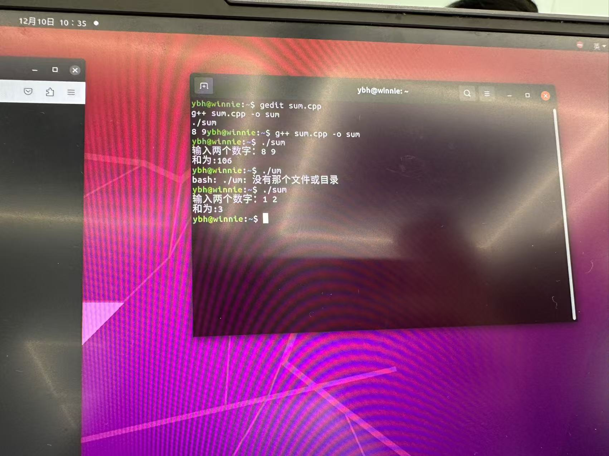
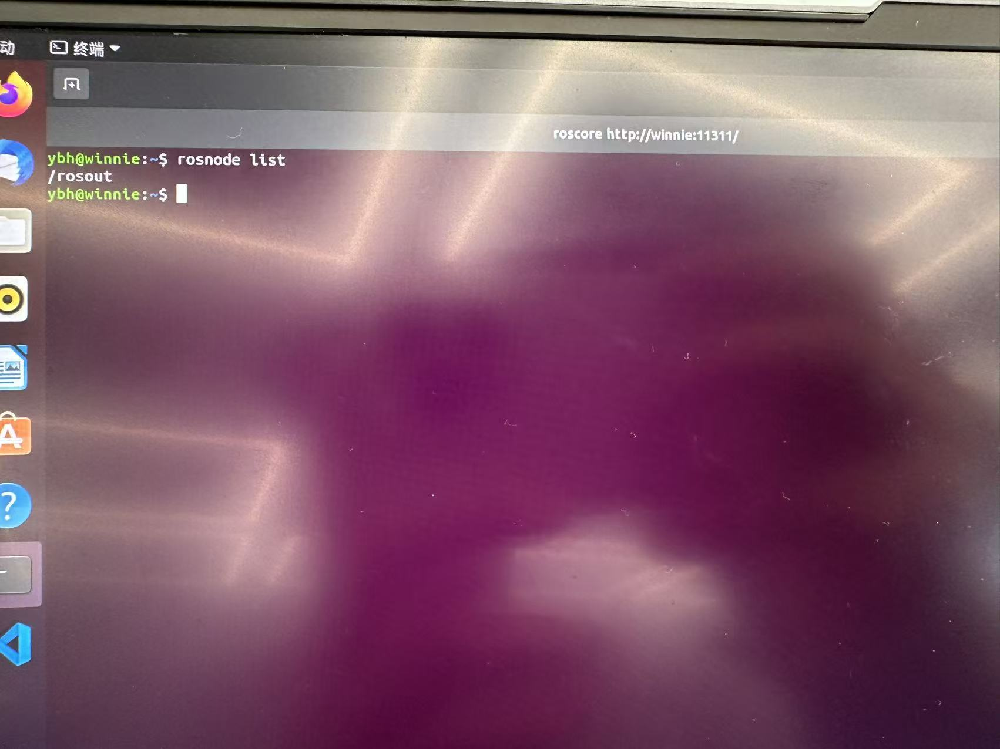
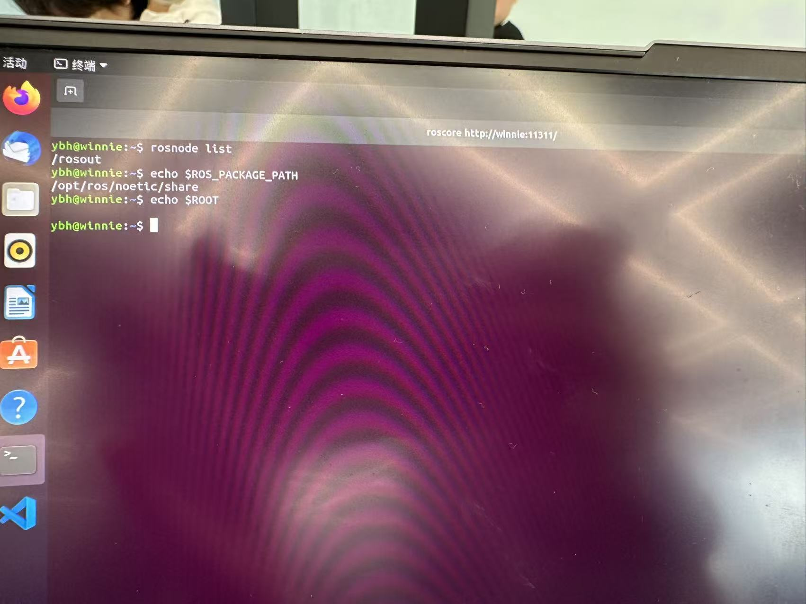
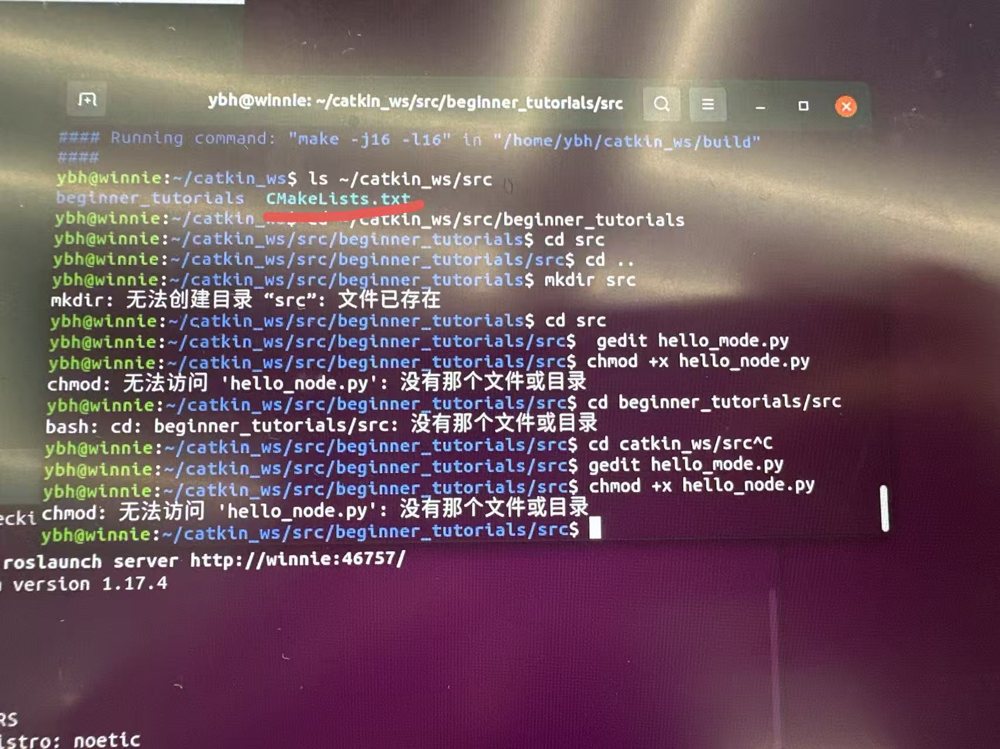
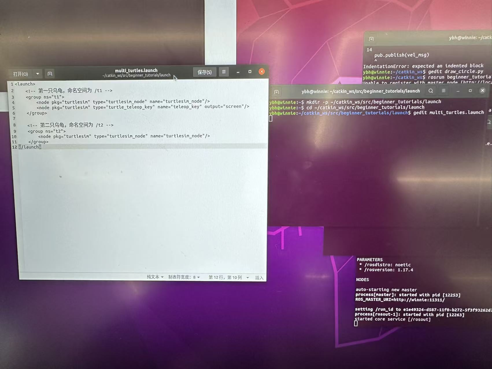

# Week2 实验报告
## 1. 实验任务
本周核心围绕 **Linux 基础操作、Python/C++ 开发环境深化、ROS1 Noetic 安装与入门、Turtlesim 仿真控制、ROS 通信机制与 Launch 文件应用** 五大模块展开，所有操作需在 Ubuntu 22.04 LTS 系统中完成，确保步骤可复现、结果可验证。必做任务如下：
1. 熟练掌握 Linux 核心命令（文件/权限/进程/软件管理）并完成实操验证；
2. 完善 Python/C++ 开发环境，实现简单编程与 VSCode 调试；
3. 完成 ROS1 Noetic 安装与环境配置，验证核心功能可用性；
4. 创建 ROS 工作空间与功能包，编写并运行 HelloWorld 节点；
5. 实现 Turtlesim 小乌龟的键盘控制、话题控制与程序自动控制（画圆）；
6. 编写 Launch 文件启动多只小乌龟，配置命名空间并验证通信关系。

## 2. 实现过程（含详细步骤与截图要求）
### 2.1 任务 1：Linux 基础命令练习
#### 2.1.1 核心命令分类与实操步骤
| 命令类型 | 关键操作 | 详细步骤 |
|----------|----------|----------|
| 文件管理 | 创建文件/文件夹 | 1. 打开终端（Ctrl+Alt+T）；<br>2. 执行 `mkdir test_dir` 创建文件夹；<br>3. 执行 `touch test_file.txt` 创建文件；<br>4. 执行 `mv test_file.txt test_dir/` 移动文件至文件夹；<br>5. 执行 `rm -rf test_dir/` 删除文件夹及内部文件 |
| 软件安装 | apt 安装指定软件（以 tree 为例） | 1. 终端执行 `sudo apt update` 更新软件源；<br>2. 执行 `sudo apt install tree -y` 安装目录树查看工具；<br>3. 执行 `tree --version` 验证安装成功 |
| 进程管理 | 查看并终止进程（以 firefox 为例） | 1. 执行 `ps -ef | grep firefox` 查找火狐浏览器进程 PID；<br>2. 执行 `kill -9 进程PID` 强制终止进程；<br>3. 再次执行 `ps -ef | grep firefox` 确认进程已终止 |

#### 2.1.2 截图要求
- 文件管理全流程截图（需包含 mkdir/touch/mv/rm 命令执行结果）；

- apt 安装软件截图；

- 进程管理截图（含 ps 查找进程、kill 终止进程、再次查询确认的完整终端输出）。


### 2.2 任务 2：Python 与 C++ 编程练习
#### 2.2.1 Python 环境配置与 HelloWorld 实现
1. 环境检查：终端执行 `python3 --version` 和 `pip3 --version`，确认 Python3 与 pip3 已安装（Ubuntu 22.04 默认预装）；
2. 编写程序：
   - 终端执行 `mkdir python_test && cd python_test` 创建文件夹并进入；
   - 执行 `touch hello.py` 创建文件，用 VSCode 打开并输入代码：
     ```python
     print("Hello World! This is Week2 Python Test.")
     ```
   - 终端执行 `python3 hello.py` 运行程序，查看输出结果。

#### 2.2.2 C++ 环境配置与求和程序实现
1. 编译环境验证：终端执行 `g++ --version`，若未安装则执行 `sudo apt install build-essential -y` 安装 GCC/G++ 工具链；
2. 编写程序：
   - 执行 `mkdir cpp_test && cd cpp_test` 创建文件夹并进入；
   - 执行 `touch sum.cpp` 创建文件，用 VSCode 打开并输入代码：
     ```cpp
     #include <iostream>
     using namespace std;
     int main() {
         int a, b;
         cout << "请输入两个整数（空格分隔）：";
         cin >> a >> b;
         cout << "两数之和为：" << a + b << endl;
         return 0;
     }
     ```
3. 编译运行：
   - 终端执行 `g++ sum.cpp -o sum` 编译代码，生成可执行文件；
   - 执行 `./sum` 运行程序，输入测试数据（如 3 5），验证输出结果（8）。

#### 2.2.3 VSCode 调试配置（以 C++ 程序为例）
1. 打开 VSCode，打开 cpp_test 文件夹，点击左侧「运行和调试」（Ctrl+Shift+D）；
2. 点击「创建 launch.json 文件」，选择「C++ (GDB/LLDB)」→「g++ - 生成和调试活动文件」，自动生成 launch.json 配置文件；
3. 配置文件修改（确保路径正确）：
   ```json
   {
       "version": "0.2.0",
       "configurations": [
           {
               "name": "g++ - 生成和调试活动文件",
               "type": "cppdbg",
               "request": "launch",
               "program": "${fileDirname}/${fileBasenameNoExtension}",
               "args": [],
               "stopAtEntry": false,
               "cwd": "${fileDirname}",
               "environment": [],
               "externalConsole": false,
               "MIMode": "gdb",
               "setupCommands": [
                   {
                       "description": "为 gdb 启用整齐打印",
                       "text": "-enable-pretty-printing",
                       "ignoreFailures": true
                   }
               ],
               "preLaunchTask": "C/C++: g++ 生成活动文件",
               "miDebuggerPath": "/usr/bin/gdb"
           }
       ]
   }
   ```
4. 打断点（点击代码行号左侧），点击「启动调试」（F5），逐步执行（F10 单步跳过），观察变量变化。

#### 2.2.4 截图要求
- Python 程序运行截图（终端显示 HelloWorld 输出）；

- C++ 程序编译与运行截图（含 g++ 编译命令、输入测试数据及求和结果）；


- VSCode 调试截图。


### 2.3 任务 3：ROS1 Noetic 安装与验证
#### 2.3.1 安装步骤（Ubuntu 22.04 适配版）
1. 配置软件源：
   - 终端执行 `sudo sh -c 'echo "deb http://packages.ros.org/ros/ubuntu $(lsb_release -sc) main" > /etc/apt/sources.list.d/ros-latest.list'`；
   - 设置密钥：`sudo apt-key adv --keyserver 'hkp://keyserver.ubuntu.com:80' --recv-key C1CF6E31E6BADE8868B172B4F42ED6FBAB17C656`。
2. 安装 ROS Noetic：
   - 执行 `sudo apt update` 更新源；
   - 执行 `sudo apt install ros-noetic-desktop-full -y`（完整版含 turtlesim 等工具）。
3. 初始化 rosdep：
   - 执行 `sudo rosdep init`（若报错“找不到命令”，先执行 `sudo apt install python3-rosdep -y`）；
   - 执行 `rosdep update`（若超时可更换国内源或使用鱼香 ROS 辅助工具）。
4. 配置环境变量：
   - 执行 `echo "source /opt/ros/noetic/setup.bash" >> ~/.bashrc`；
   - 执行 `source ~/.bashrc` 使配置生效。

#### 2.3.2 功能验证步骤
1. 启动 ROS 核心：终端执行 `roscore`，显示「started core service [/rosout]」即启动成功；
2. 新开终端，执行 `rosnode list`，应显示「/rosout」节点；
3. 验证环境变量：执行 `echo $ROS_PACKAGE_PATH`，应显示「/opt/ros/noetic/share」。

#### 2.3.3 截图要求
- roscore 启动成功截图（终端显示核心服务启动信息）；

- rosnode list 输出截图（清晰显示 /rosout 节点）；

- 环境变量截图（echo $ROS_PACKAGE_PATH 输出结果）。


### 2.4 任务 4：CATKIN 工作空间与功能包创建
#### 2.4.1 工作空间创建步骤
1. 创建目录结构：
   ```bash
   mkdir -p ~/catkin_ws/src  # 创建工作空间及源码目录
   cd ~/catkin_ws/src         # 进入源码目录
   catkin_init_workspace      # 初始化工作空间（生成 CMakeLists.txt 链接）
   ```
2. 编译工作空间：
   ```bash
   cd ~/catkin_ws  # 回到工作空间根目录
   catkin_make     # 编译（生成 devel、build 目录）
   ```
3. 配置工作空间环境变量：
   ```bash
   echo "source ~/catkin_ws/devel/setup.bash" >> ~/.bashrc
   source ~/.bashrc  # 生效配置
   ```

#### 2.4.2 功能包创建与 HelloWorld 节点实现
1. 创建功能包：
   ```bash
   cd ~/catkin_ws/src
   catkin_create_pkg beginner_tutorials roscpp rospy std_msgs  # 依赖 ROS C++/Python 库及标准消息库
   ```
2. 编写 C++ 版本 HelloWorld 节点：
   - 进入功能包 src 目录：`cd ~/catkin_ws/src/beginner_tutorials/src`；
   - 创建文件：`touch hello_node.cpp`，输入代码：
     ```cpp
     #include <ros/ros.h>
     int main(int argc, char** argv) {
         ros::init(argc, argv, "hello_node");  // 初始化节点，节点名 hello_node
         ros::NodeHandle nh;                   // 创建节点句柄
         ROS_INFO("Hello ROS! This is Week2 HelloWorld Node.");  // 输出日志信息
         ros::spinOnce();  // 处理回调（此处无回调，仅维持节点运行）
         return 0;
     }
     ```
3. 修改功能包 CMakeLists.txt（关键配置）：
   ```cmake
   # 找到依赖包
   find_package(catkin REQUIRED COMPONENTS roscpp rospy std_msgs)
   # 声明可执行文件
   add_executable(hello_node src/hello_node.cpp)
   # 链接依赖库
   target_link_libraries(hello_node ${catkin_LIBRARIES})
   ```
4. 编译与运行：
   ```bash
   cd ~/catkin_ws  # 工作空间根目录
   catkin_make     # 编译功能包
   rosrun beginner_tutorials hello_node  # 运行节点（需先启动 roscore）
   ```

#### 2.4.3 截图要求
- 工作空间创建与 catkin_make 编译截图（显示 build、devel 目录生成过程）；

- beginner_tutorials 功能包目录截图（清晰显示 src、include、CMakeLists.txt 等文件）；

- HelloWorld 节点运行截图（终端显示 ROS_INFO 输出的日志信息）。


### 2.5 任务 5：Turtlesim 小乌龟基础控制
#### 2.5.1 键盘控制小乌龟
1. 启动 ROS 核心：`roscore`（终端 1）；
2. 启动小乌龟仿真器：`rosrun turtlesim turtlesim_node`（终端 2，弹出小乌龟窗口）；
3. 启动键盘控制节点：`rosrun turtlesim turtle_teleop_key`（终端 3，按提示用方向键控制）。

#### 2.5.2 rostopic 命令控制小乌龟
1. 查看速度话题：`rostopic list`（找到 /turtle1/cmd_vel 话题）；
2. 发布速度指令（让小乌龟直线前进）：
   ```bash
   rostopic pub -r 10 /turtle1/cmd_vel geometry_msgs/Twist "linear:
     x: 0.2
     y: 0.0
     z: 0.0
   angular:
     x: 0.0
     y: 0.0
     z: 0.0"
   ```
   （-r 10 表示每秒发布 10 次，x 方向线速度 0.2 m/s）。

#### 2.5.3 程序控制小乌龟画圆（Python 版本）
1. 进入功能包 scripts 目录：`cd ~/catkin_ws/src/beginner_tutorials/scripts`；
2. 创建文件：`touch turtle_circle.py`，输入代码：
   ```python
   #!/usr/bin/env python3
   import rospy
   from geometry_msgs.msg import Twist

   if __name__ == "__main__":
       rospy.init_node("turtle_circle_node")  # 节点名
       pub = rospy.Publisher("/turtle1/cmd_vel", Twist, queue_size=10)  # 发布 cmd_vel 话题
       rate = rospy.Rate(10)  # 10Hz
       twist = Twist()
       twist.linear.x = 0.2  # 线速度（x方向）
       twist.angular.z = 0.5  # 角速度（z方向，控制转弯）
       while not rospy.is_shutdown():
           pub.publish(twist)
           rate.sleep()
   ```
3. 添加执行权限：`chmod +x turtle_circle.py`；
4. 编译与运行：
   ```bash
   cd ~/catkin_ws && catkin_make  # 编译（确保 Python 脚本被识别）
   rosrun beginner_tutorials turtle_circle.py  # 运行画圆节点
   ```

#### 2.5.4 截图要求
- 键盘控制截图（含 turtlesim 窗口、teleop_key 终端提示、小乌龟移动轨迹）；

- rostopic pub 命令截图（完整显示命令格式与终端输出）；

- 画圆程序运行截图（turtlesim 窗口显示圆形轨迹，终端无报错）。


### 2.6 任务 6：多乌龟 Launch 文件与通信可视化
#### 2.6.1 Launch 文件编写（多乌龟配置）
1. 进入功能包 launch 目录（无则创建）：`mkdir -p ~/catkin_ws/src/beginner_tutorials/launch && cd $_`；
2. 创建文件：`touch multi_turtle.launch`，输入代码：
   ```xml
   <launch>
       <!-- 启动第一个小乌龟，命名空间 turtle1 -->
       <node name="turtlesim1" pkg="turtlesim" type="turtlesim_node" ns="turtle1">
           <remap from="/turtle1/cmd_vel" to="/turtle1/cmd_vel"/>  <!-- 话题重映射（保持命名空间一致性） -->
       </node>
       <!-- 启动第二个小乌龟，命名空间 turtle2 -->
       <node name="turtlesim2" pkg="turtlesim" type="turtlesim_node" ns="turtle2">
           <remap from="/turtle2/cmd_vel" to="/turtle2/cmd_vel"/>
       </node>
       <!-- 启动键盘控制节点（控制 turtle1） -->
       <node name="teleop1" pkg="turtlesim" type="turtle_teleop_key" ns="turtle1">
           <remap from="/turtle1/cmd_vel" to="/turtle1/cmd_vel"/>
       </node>
   </launch>
   ```

#### 2.6.2 多乌龟控制与可视化步骤
1. 启动 Launch 文件：`roslaunch beginner_tutorials multi_turtle.launch`（自动启动 roscore 及两个小乌龟窗口）；
2. 控制指定乌龟（以 turtle2 为例）：
   ```bash
   rostopic pub -r 10 /turtle2/cmd_vel geometry_msgs/Twist "linear:
     x: 0.2
     y: 0.0
     z: 0.0
   angular:
     x: 0.0
     y: 0.0
     z: -0.5"
   ```
3. 通信关系可视化：`rqt_graph`（显示两个乌龟节点与话题的连接关系）；
4. 速度数据可视化：`rqt_plot /turtle1/cmd_vel/linear/x /turtle2/cmd_vel/linear/x`（绘制两只乌龟的 x 方向线速度曲线）。

#### 2.6.3 截图要求
- Launch 文件源码截图（完整显示 XML 配置内容）；

- 多乌龟启动截图（两个 turtlesim 窗口同时显示）；
- rqt_graph 截图（清晰显示两个命名空间下的节点与话题通信）；
- rqt_plot 截图（速度曲线正常显示）。


## 3. 常见问题与解决方法
### 3.1 ROS 安装相关问题
- 问题现象：`rosdep update` 超时失败；
- 原因分析：国外服务器访问受限；
- 解决方法：使用国内镜像源（如清华源），或执行 `sudo pip3 install rosdepc` 安装 rosdepc 替代工具，再执行 `rosdepc update`。

### 3.2 功能包编译问题
- 问题现象：`catkin_make` 编译时提示“找不到头文件”或“未定义引用”；
- 原因分析：CMakeLists.txt 配置缺失（未添加可执行文件、未链接依赖）；
- 解决方法：检查 CMakeLists.txt 中 `add_executable`、`target_link_libraries` 配置，确保路径与依赖包正确。

### 3.3 多乌龟控制问题
- 问题现象：Launch 文件启动后，只能控制一只乌龟；
- 原因分析：命名空间未配置或话题重映射错误；
- 解决方法：确认每个节点的 `ns` 属性唯一，`remap` 标签映射的话题与命名空间一致。

### 3.4 VSCode 调试问题
- 问题现象：调试 C++ 程序时提示“找不到可执行文件”；
- 原因分析：launch.json 中 `program` 路径配置错误；
- 解决方法：确保 `program` 路径为 `${fileDirname}/${fileBasenameNoExtension}`，且已提前通过 g++ 编译生成可执行文件。

## 4. 核心模块理解
### 4.1 Linux 基础模块
- 核心逻辑：Linux 以命令行为核心，文件系统采用树形结构，权限管理（所有者/组用户/其他用户）是安全核心；
- 关键命令：`sudo`（管理员权限）、`apt`（包管理）、`ls/cat/mv/rm`（文件操作）、`ps/kill`（进程管理），需掌握命令参数组合（如 `rm -rf`、`ps -ef | grep`）。

### 4.2 Python/C++ 开发环境模块
- Python 特性：无需编译，直接通过解释器运行，适合快速开发；
- C++ 特性：需通过 g++ 编译生成可执行文件，运行效率高，ROS 核心开发常用；
- VSCode 核心：通过插件扩展功能（Python/C++ 插件），launch.json 配置调试参数，实现代码编辑、编译、调试一体化。

### 4.3 ROS1 Noetic 基础模块
- 核心架构：ROS 是分布式框架，通过「节点（Node）- 话题（Topic）- 消息（Message）」实现通信；
- 关键概念：
  - 工作空间（catkin_ws）：存放功能包的目录，包含 src（源码）、devel（编译输出）、build（编译中间文件）；
  - 功能包（Package）：ROS 程序的基本单元，包含源码、配置文件等，需声明依赖；
  - 常用命令：`roscore`（启动核心）、`rosrun`（运行单个节点）、`roslaunch`（批量启动节点）、`rostopic`（操作话题）、`rosnode`（管理节点）。

### 4.4 Turtlesim 与通信机制模块
- Turtlesim 作用：ROS 官方仿真工具，用于验证通信机制与控制逻辑，无需硬件支持；
- 话题通信：`/cmd_vel` 是速度控制话题，发布者（Publisher）发送 Twist 消息（线速度+角速度），订阅者（turtlesim 节点）接收并执行运动指令；
- 命名空间（Namespace）：用于隔离多节点/多设备，避免话题名称冲突（如 `/turtle1/cmd_vel` 与 `/turtle2/cmd_vel`）。

### 4.5 Launch 文件模块
- 核心优势：一次性启动多个节点，支持命名空间、话题重映射、参数配置，简化开发流程；
- 关键标签：`<launch>`（根标签）、`<node>`（启动节点，指定 pkg/type/name/ns）、`<remap>`（话题重映射），需注意标签嵌套格式。

## 5. 总结与心得
本周任务在 Week1 Ubuntu 基础环境上，进一步深化了 Linux 操作与开发环境配置，核心突破是 ROS1 Noetic 的安装与应用。从 Linux 命令的熟练使用，到 Python/C++ 程序的编写与调试，再到 ROS 工作空间、功能包、节点、话题的层层递进，我逐步理解了 ROS 分布式框架的核心逻辑——通过节点拆分功能，通过话题实现数据交互，通过 Launch 文件简化部署。

在实践中，遇到的 `rosdep update` 超时、CMakeLists.txt 配置错误、多乌龟命名空间冲突等问题，让我深刻体会到“配置文件的准确性”和“命令行调试的重要性”。通过查阅 ROS Wiki、鱼香 ROS 教程等资料，逐一解决问题的过程，不仅提升了故障排查能力，也培养了“按文档操作、按日志定位问题”的工程思维。

Turtlesim 仿真的实操让抽象的 ROS 通信机制变得直观，从键盘控制到程序画圆，再到多乌龟协同控制，我清晰地看到了“发布者-订阅者”模式的工作流程。Launch 文件的使用则让我感受到 ROS 工具链的高效，无需重复启动多个终端，只需一个文件即可批量启动节点并配置参数。

这些基础操作的掌握，为后续学习 ROS 进阶功能（如服务、动作、参数服务器）、机器人仿真与实物开发打下了坚实基础。同时，Linux 命令行与 ROS 工具链的结合使用，也让我体会到开源开发环境的灵活性与强大性，后续需加强命令参数与配置文件的记忆，提升开发效率。
